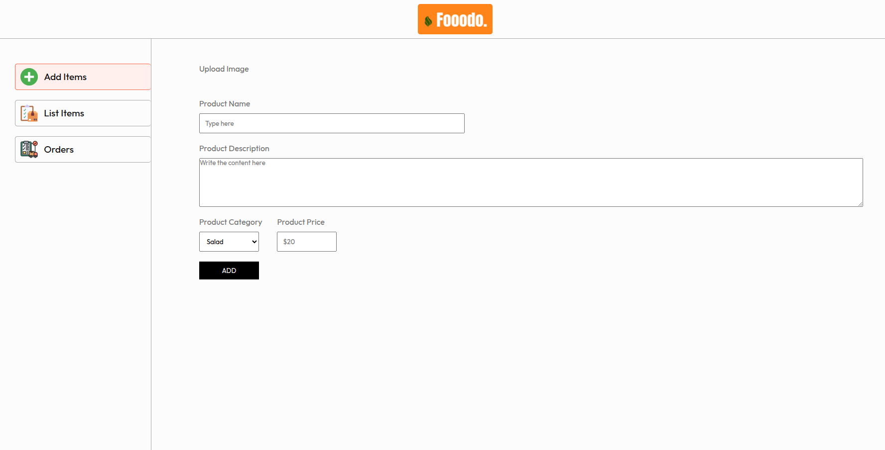
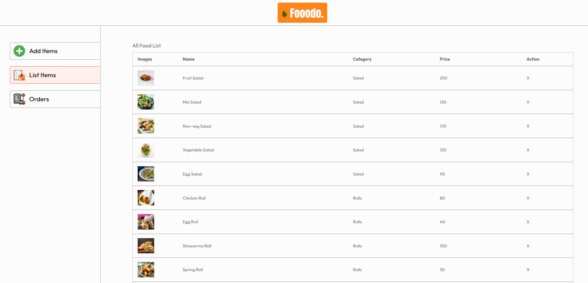
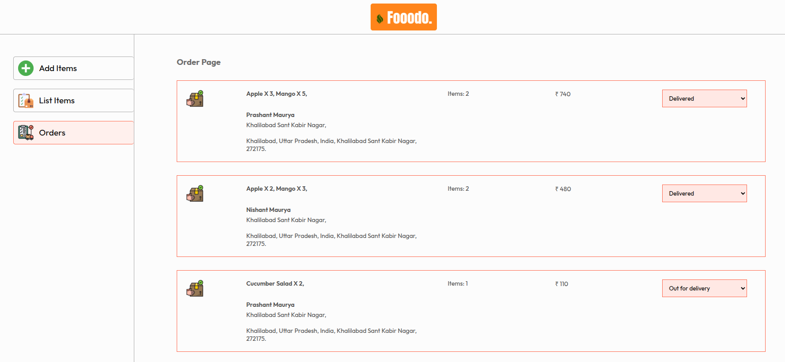

# Fooodo Admin Panel 🍽️

The **Fooodo Admin Panel** is a powerful and intuitive dashboard designed to manage the Fooodo platform's products and customer orders. This panel allows admins to:

- **Add New Products** 🥗
- **View and Manage Product Listings** 🍕
- **Handle Customer Orders Efficiently** 📦

---

## Features 🚀

### 1️⃣ Add New Product
  
Easily add new products to the Fooodo platform by providing product details like name, price, description, and image.

### 2️⃣ Product List
  
View a list of all available products with details like price, availability, and options to edit or delete products.

### 3️⃣ Manage Customer Orders
  
Track and manage customer orders with real-time updates on order status and customer details.

---

## Tech Stack 🛠️
- **Frontend:** React.js + CSS
- **Backend:** Node.js + Express.js
- **Database:** MongoDB

---

## Getting Started 🏁

### Prerequisites
Make sure you have the following installed:
- Node.js
- npm 

### Installation
1. Clone the repository:
```bash
git clone https://github.com/your-repo/fooodo-admin.git

```bash
cd fooodo-admin

```bash
npm install

```bash
npm run dev

## Contributing 💡
We welcome contributions! Feel free to fork the repo and submit pull requests.

## Contact 📬
For any questions or feedback, reach me at: mauryaprashant1510@gmail.com  or https://www.linkedin.com/in/prashant-maurya-017776246/
